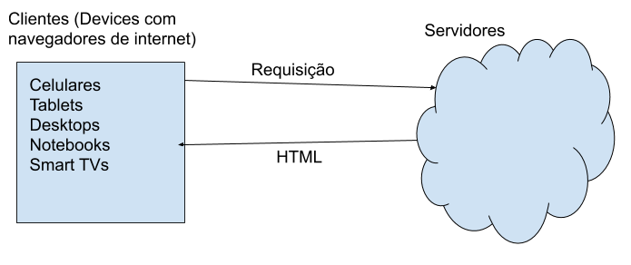

## O que é HTML?

Hypertext Markup Language

'pt-BR': Linguagem de Marcação de Hipertexto

Documento texto que descreve como o conteúdo do mesmo deve ser exibido. Esse normalmente é lido pelos navegadores de internet (Chrome, Firefox, Safari, e outros), que exibe o conteúdo para os usuários :)



Para estruturar o conteúdo do documento é útilizada uma estruturada de Tags, exemplo:

```
<p> Isso é um paragrafo </p>
```

`<p>` indica que ali começa o paragrafo
`</p>` indica que ali acaba o paragrafo

[Documento Exemplo com algumas TAGS](example.html)


## Adicionando estilo com CSS

#### O que é?

CSS Significa Cascading Style Sheets, e é utilizado para estilização do conteúdo estruturado em HTML. Dessa maneira, se você quiser alterar cor, tamanho, fonte, disposição e outras propriedades de estilo do conteúdo, você deverá fazer através do CSS.

#### Como colocar

Existem 3 maneiras de se adicionar CSS ao HTML, inline, internal e external.

###### Inline

Nesse caso o estilo é adicionado diretamente à TAG html, utilizando a propriedade style.

```
<p style="color: blue;"> Isso é um paragrafo </p>
```

###### Internal

Escrevendo as definições de estilo em CSS dentro da tag style, colocada dentro do head.

```
<head>
...

  <style>
    p {
      color: blue;
    }
  </style>

</head>
```

###### External

Carregando um arquivo separado com as definições de estilo escritas em CSS através da tag link, que é colocada dentro do head.

```
<head>
  ...
  <link rel="stylesheet" href="style.css" />

</head>
```

## Metadados

METADADOS
Palavras chave
Pra que? (SEO)
Onde encontra mais


Referências:
https://www.w3schools.com/html/
https://www.w3schools.com/tags/default.asp
https://www.theserverside.com/definition/HTML-Hypertext-Markup-Language
